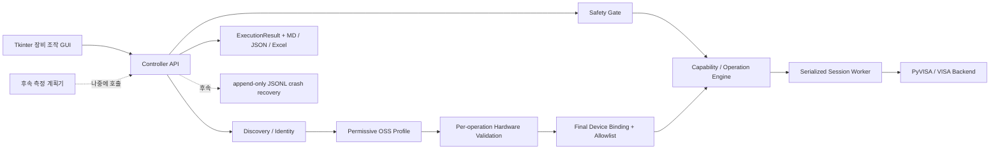

# 범용 SCPI 장비 조작 자동화 V1 개발 계획서

작성일: 2026-07-25
문서 상태: 구현·검증 중
새 프로젝트 경로: 이 저장소의 루트
기준 프로그램: 저장소 밖의 기존 시험용 프로그램 — 수정하지 않고 동작·명령 순서 참고용으로만 사용

## 1. 결정 사항

새 프로젝트는 기존 `SEreport`와 완전히 분리해서 진행한다.

- `SEreport`는 앞으로도 실제 시험에 계속 사용하므로 파일을 수정하거나 구조 변경·패키징 실험을 하지 않는다.
- 새 프로젝트가 기존 시험 절차를 재현할 때도 `SEreport` 코드는 읽기 전용 기준본으로 취급한다.
- 재사용할 가치가 있는 로직은 새 프로젝트에 필요한 최소 범위만 별도로 이식하고, 출처 파일과 동작 근거를 기록한다.
- 새 프로그램 검증이 끝나기 전에는 실제 시험 운영을 `SEreport`에서 새 프로그램으로 전환하지 않는다.
- 새 프로그램과 `SEreport`가 동시에 같은 장비를 제어하지 않도록 실행 시 장비 점유 상태를 확인한다.
- **장비 조작 루틴과 측정 계획의 의미·데이터 모델은 분리한다.**
- V1 UI 안에는 검색·루틴·계획·실행·결과의 5단계를 배치한다. 루틴은
  동작 순서와 절차 제어값을, 계획은 시험 케이스별 실제 설정값을 담당한다.
- 검토된 수치 필드의 계획값 binding과 시험 케이스 반복은 V1에 포함한다.
  조건 분기, 계산식, 임의 변수와 병렬 실행은 후속 측정 계획기에서 담당한다.
- 후속 계획기도 안정된 Controller API를 통해 결합하며 VISA나 SCPI를 직접 다루지 않게 한다.

### V1 현재 구현 상태

현재 Tkinter UI에는 `1. 장비 찾기 → 2. 루틴 설정 → 3. 계획서 →
4. 실제 실행 → 5. 결과 확인`의 5개 탭이 구현되어 있다. 첫 탭에는 초보자
안내형 장비 검색과 read-only `*IDN?` 분류가 들어 있다. 로컬 카탈로그의
12개 자료는 permissive 오픈소스 드라이버·프로필을 근거로 만든
검증 시작용 프로필이다. 정확한 IDN 일치는 프로필 선택 근거일 뿐
분류 확인이나 실장비 검증을 면제하지 않는다. 일치하지 않는 모델은 장비
종류와 기준 프로필을 선택한 뒤 operation별 검증을 수행한다.

현재 공개 카탈로그에는 12개 OSS 근거 프로필, 237개 capability와 390개
구조화된 operation이 있다. 제조사 매뉴얼 원문, 명령 색인, 명령과 페이지의
대응표 및 그 밖의 매뉴얼 추출물은 저장소와 배포물에 포함하지 않는다.
`manual_catalog.json`은 문서명·문서번호·버전·공식 URL 같은 서지정보만
제공하며, 링크 수록은 문서 재배포 허가를 뜻하지 않는다.

FSV/FSVA legacy의 공개 프로필은 QCoDeS contrib의 permissive 소스로 확인한
14개 capability와 25개 operation만 포함한다. Trace, Marker, Detector,
Averaging 같은 기능 개념은 범용 분석기 taxonomy와 계획·UI 설계에 남긴다.
그러나 해당 기능의 FSV/FSVA 모델별 SCPI 템플릿은 사용자가 보유한 실장비에서
독립적으로 검증한 뒤 그 장비에 묶인 로컬 기능으로만 확장한다.

사용자가 적법하게 보유한 매뉴얼로 직접 만든 명령 후보는 저장소 밖의 사용자
로컬 폴더에서만 불러온다. 원문, OCR 텍스트, 명령 목록, 페이지 매핑과 추출
중간 파일은 Git·설치본·실행파일에 넣지 않는다. GUI의 `내 로컬 명령 후보`
편집창은 이 로컬 자료를 `조회 / 설정 / 실행`의 typed extension으로 만드는
도구다. SCPI template, parameter 타입·단위·범위·선택값, 시험값, 응답형,
위험도와 paired readback Query를 명시한 뒤 IDN·옵션 재확인과 동일한 operation
검증 절차를 통과한 항목만 로컬 레지스트리에 승격한다. 옵션은
조회됨·미지원·미조회로 구분하고 live 상태를 명령 직전에 다시 확인한다.
정의나 PASS 증거가 달라지면 레지스트리 로딩을 거부하며, persisted JSON은
Windows 사용자 DPAPI로 보호한 키의 HMAC-SHA256 인증과 JSON·state·key anchor의
동일 세대/digest 확인까지 통과해야 한다. JSON과 state의 구버전 동시 복원은
차단한다. 외부 단조 카운터가 없는 오프라인 환경에서는 세 파일 전체를 같은
과거 백업으로 되돌린 경우까지 판별할 수 없으므로 전체 백업 복원 뒤에는 로컬
기능을 재검증한다. 동시에 열린 프로그램 창은 파일 잠금 안에서 기준
generation/digest가 최신인지 비교해 오래된 스냅샷 저장을 거부한다.

승격 기록은 배포 프로필을 수정하지 않고 exact manufacturer·model·serial·
firmware·option, 사용자 로컬 출처 식별자와 전체 검증 증거를 함께 저장한다.
설정은 Query → 시험값 쓰기 → Readback → 원복 → 원복 Readback을 모두
통과해야 한다. Execute는 자동 송신하지 않고 별도 시험에서 운영자가 관찰한
근거와 고위험 기능의 개별 승인을 요구한다. 로컬 SET/EXECUTE는 낮은
위험도로 내릴 수 없다.
최초 승격은 실제로 시험한 값·채널·Trace·선택지 조합에 잠그며, 범위나
선택지를 넓히려면 별도 검증 기록을 만든다. 재검증에 실패하면 로컬 실행
기능 등록을 해제한다.

루틴 설정 탭은 기능을 그룹·검색하고 주파수, 채널, Trace, Marker 등
파라미터와 조회 결과명을 입력할 수 있다. Hz/kHz/MHz/GHz와 시간·전압·전류·
전력·저항의 자주 쓰는 SI 단위를 UI에서 고르고 기존 기준 단위로 정규화한
값만 검증 엔진에 전달한다. `false/true`, `WRIT/MAXH` 같은 내부값은 뜻을
풀어 쓴 표시 이름과 분리한다. 공통 단계 `Delay`와 대상 장비·유한 timeout을
가진 `Wait for Completion`, 순서 이동·복제·삭제·우클릭 메뉴도 제공한다.
장비 선택이 달라져도 남아 있는 장비와 PC 대기 단계는 보존하고 빠진 장비
단계만 제거한다. 작성 순서는 UTF-8 JSON schema v5로 저장하고 raw IDN, 장비
펌웨어·옵션 상태·응답·카탈로그 fingerprint와 operation별
통과·실패·미확인 목록을 함께 보관하며 v1~v4 파일도 읽는다. 저장된
allowlist·상태값 자체는 스키마 버전과 관계없이 권한으로 사용하지 않고 현재
선택 장비의 검증 결과와 다시 결합한다. 공통 장비 분류 카드는 설명·데모
전용이며 실제 operation PASS를 대신할 수 없다. 필요한 장비가
없거나 모호하면 기존 초안을 그대로 유지한다.

세 번째 `계획서` 탭에는 기존 스펙트럼 분석기·신호발생기 빠른 주파수
설정을 유지하고, 8개 장비 분류의 25개 통상 시험 방법을 선택하는 스크롤
상세창을 추가했다. 표준·절차서, 시료, 환경, 안정화, 반복, 교정, 합격 기준과
장비별 상세 조건을 기록한다. Hz·s·V·A·W·Ω 상세 숫자도 표시 단위를
선택하고 기준 단위로 정규화한다. Pulse Width/Period, OVP/OCP, DMM 단자·Fuse,
Scope Probe·접지·50 Ω 입력, LCR Bias·방전, VNA Calibration·Segment 등
연관 조건도 검증한다. 표준 예시는 참고 후보이며 준수를 보증하지 않고,
계획값은 실제 프로필의 모델·옵션·범위 검사를 대신하지 않는다. 계획 단계
자체는 SCPI를 전송하지 않으며, 네 번째 탭으로 이동할 때 실행 결과에 포함할
immutable snapshot으로 고정한다. 장비별 명령과 안전 한계는 실장비 검증 후
Controller에 연결한다.

네 번째 `실제 실행` 탭은 루틴과 계획을 동시에 보여 주고 Dry Run을 기본으로
실행한다. 같은 장비·루틴·계획 snapshot의 Dry Run이 성공해야 실제 실행
버튼이 열리며 snapshot이 바뀌면 다시 확인한다. 데모 resource는 실제 전송을
차단한다. 실제 실행은 장비 시리얼·resource와 설정 요약을 확인한 운영자 승인
뒤에만 시작하며, 현재 effective profile
fingerprint와 검증 당시 fingerprint, exact IDN·serial·firmware·option을 다시
확인한다. 루틴 feature만 authoritative profile operation으로 다시 해석하고,
계획 항목은 명령으로 변환하지 않는다. Delay는 PC에서 중지 가능하게 수행하며
완료 대기는 PASS인 `*OPC?`가 없으면 거부한다. 출력 가능 장비의 쓰기는
프로파일별 명시 안전 종료 operation이 PASS여야 한다. 오류·중지·긴급정지 때
OFF와 가능한 readback 결과를 별도 기록한다.
별도 디스플레이 창은 새로운 VISA polling을 만들지 않고 실행 이벤트와 최종
측정 레코드에서 실제 Query 응답만 읽는다. 선택 장비 전체 또는 한 대를
전환해 볼 수 있고, Trace/Waveform으로 명시된 숫자 배열만 그래프로 그린다.
조회 전 값, 가짜 곡선, 보간한 측정점은 만들지 않는다.

다섯 번째 `결과 확인` 탭은 실행 요약, 측정값, 실행 단계와 전체 이벤트 로그를
표시한다. JSON은 전체 실행 스냅샷, Markdown은 사람이 읽는 보고서, Excel은
요약·장비·루틴·시험계획·측정결과·실행단계·명령로그·안전종료 시트로 나눈다.
모든 형식은 오프라인으로 생성하며 Excel의 외부 문자열은 수식으로 실행되지
않게 쓴다. 실제 실행의 terminal `ExecutionResult`는 사용자 저장 동작과
별개로 Documents 아래 자동저장 폴더에 JSON으로 원자 저장한다. 사용자는 같은
결과를 MD·JSON·Excel로 추가 저장할 수 있다. 큰 배열 원본은 측정 레코드에
한 번만 보관하고 단계·이벤트는 측정값 ID를 참조한다. command 전송 전에
JSONL을 append·flush하고 비정상 종료 뒤 마지막 완전 레코드부터 복구하는
crash-recovery 저장소는 아직 후속 작업이다. Fake session 자동 테스트는
구현되어 있지만 FSV30과 신호발생기를 연결한 HIL 승인은 완료되지 않았다.

## 2. 프로젝트 목표

첫 목표는 측정 계획 편집기가 아니라 **계측기 조작기**다. PC에 연결된 계측기를 VISA로 검색하고 `*IDN?` 응답을 식별한 뒤, 사용자가 SCPI 문자열 대신 검증된 기능 단위로 장비를 설정·조회하는 Windows 프로그램을 만든다.

사용자에게 보이는 기능 예시는 다음과 같다.

- RF 출력 켜기·끄기
- 발생 주파수와 출력 레벨 설정
- 분석기 중심주파수·span·RBW·VBW 설정
- single sweep와 완료 대기
- peak search
- marker 주파수·레벨 읽기
- 장비 상태와 SCPI 오류 확인
- 연결 해제와 안전 종료

`single sweep → peak search → marker 읽기`처럼 한 장비 내부에서 원자적으로 완료되어야 하는 동작은 하나의 검증된 operation으로 제공할 수 있다. 여러 장비의 순서, 반복, 주파수 sweep와 결과 계산은 후속 계획기의 책임이다.

실제 장비에 전송할 SCPI 후보는 선택된 명령팩이 제공한다. 최종 사용 가능
명령은 그 물리 장비에서 통과한 operation allowlist가 결정한다. 장비
조작기는 GUI와 별개로 호출 가능한 Controller API를 제공하며, 실행 시 LLM,
인터넷, MCP 서버 또는 Python 설치에 의존하지 않는다.

## 3. 첫 번째 버전의 범위

### 포함

1. 실제 작동 이력이 있는 R&S FSV30 분석기 1대와 모델 미확인 신호발생기 2대
2. 설치된 VISA backend 진단
3. VISA resource 검색과 주소 수동 입력
4. 제한 시간이 적용된 `*IDN?` 조회
5. 제조사·모델·firmware·option 기반 배포 프로필 매칭
6. 전체 후보 operation의 검증 상태와 입력 가능 범위 표시
7. 실장비 검증을 통과한 기능 단위 수동 실행
8. FSV30의 배포 프로필 설정·single sweep와, 실장비 독립 검증 후 로컬로
   등록한 marker operation
9. 신호발생기의 주파수·레벨·RF 출력 operation
10. 실행 전 명령 preview와 연결 후 read-only 점검
11. UI와 분리된 단일 I/O worker, 취소와 유한 timeout
12. 정상·오류·취소·창 닫기 시 공통 안전 종료
13. 장비·루틴·계획·측정·명령·오류·안전 종료를 묶은 MD/JSON/Excel 결과
14. 후속 계획기가 호출할 안정된 Controller API
15. Python 없는 Windows PC용 PyInstaller one-folder 배포본
16. Fake transport, simulated protocol, 실제 장비 순서의 단계별 검증

### 제외

- 모든 제조사·모델을 처음부터 지원하는 통합 명령 데이터베이스
- 실행 중 LLM 또는 PDF 매뉴얼 자동 해석
- 추출한 SCPI 후보의 자동 승인·자동 실행
- 임의 Python 코드, `eval`, 플러그인 스크립트 실행
- 자유 텍스트 계획 field의 자동 해석·binding
- 조건 분기, 임의 변수와 결과 계산
- 여러 장비의 병렬 제어
- 차폐효율 시험 workflow UI
- 고전압·대전류·대전력 장비 제어
- 제조사 VISA runtime의 임의 재배포
- 온라인 프로파일 마켓과 자동 업데이트

두 신호발생기는 모델 확인 전까지 같은 모델이라고 가정하지 않는다. V1은
장비별 조작 operation을 두 물리 장비 모두에서 검증한다. 계획값을 사용하는
루틴은 명시적인 시험 케이스·반복별로 직렬 확장하고, 고정값 루틴은 기존처럼
한 번 실행한다.

## 4. 설계 원칙



핵심 경계는 다음과 같다.

- UI는 SCPI 문자열을 직접 만들거나 VISA 세션을 직접 호출하지 않는다.
- 후속 계획기도 SCPI 문자열과 VISA 세션을 직접 호출하지 않는다.
- 장비별 SCPI 차이는 배포 프로필 또는 제한된 adapter에서만 처리한다.
- IDN이 프로필의 모델명과 일치해도 모든 operation을 자동 승인하지 않는다.
- Controller가 실행할 수 있는 것은 해당 물리 장비에서 통과한 operation뿐이다.
- 한 장비의 모든 I/O는 단일 session worker가 순서대로 처리한다.
- 모든 capability 요청은 전송 전에 타입·단위·범위와 안전 등급을 검사한다.
- 검사를 통과하지 못한 요청은 장비에 명령을 한 글자도 보내지 않는다.
- 실행 중 command, response, timeout, error와 cleanup을 `ExecutionResult`에
  누적하고 완료 결과를 MD·JSON·Excel로 저장한다.
- command 전송 전 append·flush와 비정상 종료 복구를 담당하는 JSONL 저장소는
  후속 단계로 둔다.
- LLM은 향후 개발용 프로파일 초안 도구로만 사용할 수 있으며 transport를 호출할 권한이 없다.
- 초기에는 외부 플러그인 로더를 만들지 않는다. 내장 장비 모듈로 계약을 검증한 뒤 플러그인 형식으로 연다.

## 5. 계획한 프로젝트 구조

```text
SCPI-Automation-Platform/
  PROJECT_PLAN.md
  GUI_DESIGN.md
  README.md
  pyproject.toml
  src/
    scpi_automation/
      app/
      controller/
      transport/
        base.py
        pyvisa_transport.py
        fake_transport.py
      identity/
      profiles/
      capabilities/
      safety/
      records/
      devices/
        fsv30/
        signal_generator/
      ui/
  device_profiles/
    analyzer/
    signal_generator/
  tests/
    unit/
    protocol/
    integration/
  tools/
    profile_validator/
  packaging/
  docs/
  THIRD_PARTY_NOTICES.md
```

이 구조는 구현 과정에서 필요한 만큼만 생성한다. 빈 계층을 한꺼번에 만드는 방식은 사용하지 않는다.

## 6. 배포 프로필과 최종 장비 바인딩

카탈로그 원본은 사람이 검토할 수 있는 YAML 또는 JSON 파일로 관리한다.
현재 `profile`이라는 내부 이름은 permissive 오픈소스 근거가 확인된 장비군
기능 바인딩을 뜻한다. SQLite는 검색 인덱스와 장비 바인딩에 사용한다.

배포 프로필에는 최소한 다음 정보가 들어간다.

- profile ID, schema version, profile version, 검증 상태
- manufacturer와 정확한 model match 규칙
- 적용 가능한 firmware 범위와 required option
- timeout, termination, interface별 transport 설정
- 기능별 parameter 타입·단위·최소·최대값
- write/query 명령
- response parser
- 완료 대기 방식
- SCPI error queue 정책
- cleanup 동작
- 안전 등급
- 명령 근거가 된 permissive 소스의 프로젝트·revision·license
- 공식 문서의 제목·문서번호·버전·URL 같은 서지 참조

최종 장비 바인딩은 배포 프로필 원본을 수정해 만드는 것이 아니라 다음 정보를
결합한 별도 로컬 기록이다.

- resource, 전체 `*IDN?`, serial, firmware, option
- 선택한 배포 프로필 ID·버전·fingerprint
- operation별 `pass / fail / pending / skipped / unsafe / manual`
- 검증값, readback, 오류 큐, timeout, 복원 결과
- 검증 일시, 인터페이스, VISA backend와 운영자 승인 기록

따라서 같은 모델 두 대라도 firmware·option 또는 검증 결과가 다르면 사용
가능 기능 목록이 달라질 수 있다.

명령 근거와 실장비 검증 상태는 분리한다. 배포 프로필의 근거 단계는 다음과 같다.

```text
draft
  -> source_code_confirmed
```

제조사 매뉴얼 페이지 확인은 서지·개발 참고이며 공개 명령 바인딩의 재배포
근거로 사용하지 않는다. 위 단계는 permissive 소스 확인을 뜻할 뿐 장비 지원
판정이 아니다. 최종 장비에서는 operation별 상태만 사용하고, `pass`가 아닌
operation은 루틴에 노출하지 않는다. RF ON과 같은 에너지 출력 기능은 명령이
통과해도 시험별 안전 한계와 별도 승인을 요구한다.

### operation 검증 순서와 안전 단계

1. 명시된 read-only query, 응답 파싱, 오류 큐와 timeout을 확인한다.
2. 복원 가능한 write는 원래 값 조회 → 안전한 시험값 write → readback →
   원래 값 복원 → 복원 readback 순서로 확인한다.
3. execute, binary transfer, 파일·메모리 변경, reset, calibration은 자동
   일괄 시험하지 않고 `manual` 또는 `unsafe`로 격리한다.
4. RF 출력, 전압·전류·전력처럼 에너지를 인가하는 명령은 정확한 IDN,
   장비·DUT 한계와 물리적 시험 조건을 확인한 뒤 명시 승인한다.
5. 중지, timeout 또는 통신 오류가 나면 남은 시험을 멈추고 가능한 복원과
   안전 종료 결과를 기록한다.

카탈로그의 `low / medium / high`는 명령의 위험도이고, 위 검증 상태와는
별개다. `low`이면서 미검증일 수 있고, `high`이면서 기능 확인은 끝났지만
실행 때마다 추가 승인이 필요한 operation일 수 있다.

### 물리 장비, 모델 프로파일과 공통 명령 구현의 구분

현재 확보된 과거 실사용 증거는 다음과 같다.

| 장비 | 과거 실사용 결과 | 현재 식별 정보 | 새 프로젝트에서의 임시 상태 |
|---|---|---|---|
| R&S FSV30 | 정상 작동 | 모델명 확인, IDN·firmware·option 미기록 | `legacy_bench_observed` |
| 신호발생기 A | 정상 작동 | 모델명 미확인 | `legacy_bench_observed` |
| 신호발생기 B | 정상 작동 | 모델명 미확인 | `legacy_bench_observed` |

`legacy_bench_observed`는 기존 프로그램과 실제 시험에서 작동한 이력을 뜻한다. 새 프로그램의 정확한 명령·응답 로그와 장비 fingerprint가 없으므로 아직 `bench_verified`로 간주하지 않는다.

두 신호발생기가 같은 SCPI 부분집합을 받을 가능성은 높다. 실제 `SEreport`도 주파수에 `SOUR:FREQ:CW` 또는 `FREQ`, 출력 레벨에 `SOUR:POW:LEV:IMM:AMPL` 또는 `POW`, RF 출력에 `OUTP` 또는 `OUTPUT` 후보를 사용한다. 그러나 두 대에서 작동했다는 사실만으로 모든 신호발생기가 같은 명령, 범위, 단위, readback과 오류 처리를 지원한다고 일반화할 수는 없다.

재검색 후에는 다음처럼 처리한다.

1. 같은 모델·firmware·option이면 프로파일 하나와 serial별 장비 바인딩 두 개를 사용한다.
2. 모델은 다르지만 검증된 capability 구현이 같으면 identity·정격 한계가 다른 두 프로파일이 공통 command fragment를 재사용한다.
3. command, readback, 완료 대기 또는 오류 정책이 다르면 별도 capability 구현으로 분리한다.

따라서 “모든 SG용 범용 프로파일”을 만들지 않고, 배포 프로필들이 공통
command fragment를 공유하더라도 최종 사용 기능은 각 물리 장비에서 따로
검증한다.

### 공통 루틴 단계와 완료 동기화

- `Delay`는 장비에 보내는 SCPI가 아니라 PC 실행기가 수행하는 장비 독립 공통 단계다.
- `Wait for Completion`은 대상 장비와 유한한 timeout을 명시하는 단계다.
- 완료 확인은 모델 프로파일에서 검증한 `*OPC?`, `*OPC`와 상태 폴링 또는 모델 전용 상태 조회 전략으로 실행한다.
- 검증된 완료 전략이 없는 프로파일은 실행을 거부한다. 시간값을 추측하거나 `Delay`로 자동 대체하지 않는다.

## 7. 안전 요구사항

### 소프트웨어 안전

- RF ON 전에 정확한 장비 프로파일과 안전 한계를 확인한다.
- 유효 한계는 장비 정격, 시험 구성·DUT 한계, 현재 operation 요청 한계의 교집합으로 계산한다.
- 범위를 벗어난 값은 보정하거나 잘라 보내지 않고 실행을 거부한다.
- `NaN`, 무한대, 잘못된 단위와 부호를 거부한다.
- 모든 timeout, wait, 반복 횟수와 전체 실행 시간은 유한하다.
- 정상 완료, 오류, 취소와 창 닫기 모두 같은 safety finalizer를 통과한다.
- RF OFF 전송과 가능한 `OUTP?` readback 결과를 별도로 기록한다.
- 통신이 끊기면 “OFF 완료”가 아니라 “OFF 상태 미확인”으로 표시한다.
- Raw SCPI는 운영자 화면에서 제공하지 않는다. 필요한 경우 별도 개발자 모드와 명시 승인 아래에서만 연다.

### 안전의 한계

케이블 단선이나 장비 장애 후에는 소프트웨어가 전송한 RF OFF가 장비에 도달하지 않을 수 있다. 이 프로그램의 정지 기능은 하드웨어 E-stop이 아니다. 향후 고전력·고전압 장비를 지원하려면 별도 인터록과 장비 자체 보호 설정이 필요하다.

## 8. 결과와 감사 로그

현재 한 번의 Dry Run 또는 실제 실행은 immutable 장비·루틴·계획 snapshot,
실행 단계, 측정값, 이벤트와 안전 종료 기록을 하나의 `ExecutionResult`로
만든다. 다섯 번째 탭에서 개별 형식 또는 한 폴더의 묶음으로 다음 파일을
저장한다.

```text
SCPI_result_<UTC>_<run-id>.json
SCPI_result_<UTC>_<run-id>.md
SCPI_result_<UTC>_<run-id>.xlsx
```

JSON은 전체 실행 snapshot의 기계 판독 원본이고, Markdown은 사람이 확인하는
보고서다. Excel은 `요약`, `장비`, `루틴`, `시험계획`, `측정결과`,
`실행단계`, `명령로그`, `안전종료` 시트로 구분한다. 텍스트 파일과 Excel은
임시 파일을 거쳐 교체하며 Excel 문자열은 수식으로 실행되지 않게 저장한다.

현재 이벤트는 실행 중 메모리에 누적되므로 프로세스가 비정상 종료되면 완료 전
기록을 복구할 수 없다. command 전송 직전·응답 직후 append-only JSONL을
flush하고 마지막 완전 레코드부터 세션을 복구하는 기능은 후속 구현 범위다.

## 9. `SEreport`에서 참고할 범위

### 새 프로젝트로 선별 이식

- VISA resource·termination·serial 설정 방식
- FSV 분석기의 SCPI error queue 처리
- 설정 readback과 응답 검증
- single sweep의 `*OPC?` 대기와 timeout 복구
- fresh sweep 이후 marker를 읽는 실행 조건
- Fake VISA 회귀 테스트와 명령 순서 검증
- frozen path 처리

### 그대로 가져오지 않을 부분

- 11개 mixin과 하나의 거대한 공유 `self` 상태
- Tk 변수에 결합된 장비·시험 상태
- 모델을 확인하지 않는 SG/AMP 명령 후보 fallback
- RAM에만 존재하는 결과와 SCPI 로그
- Gemma 답변에서 SCPI를 추출해 실행하는 경로
- Raw SCPI routine block
- 차폐효율 routine preset, SE 계산과 측정 계획 UI
- 간단한 XLSX writer
- AI 분석·그래프·표준 문서 기능의 필수 의존성

이식 전후의 명령 sequence를 테스트로 비교하되, `SEreport` 파일 자체는 변경하지 않는다.

## 10. 개발 단계와 승인 기준

### 단계 0 — 사실 수집과 기준선 고정

작업:

- 실제 시험에 사용하는 `SEreport` 기준본 또는 EXE 식별
- FSV30과 신호발생기 두 대의 전체 `*IDN?`, resource, firmware, option 수집
- 현재 VISA 공급사·버전·32/64비트 확인
- 세 장비에서 실제 사용한 개별 설정·조회 명령과 안전 한계 기록
- 기존 Fake VISA 회귀 테스트 결과 보존

통과 기준:

- 세 물리 장비를 모호하지 않게 식별하고 두 신호발생기가 같은 모델인지 확인할 수 있다.
- RF 출력과 주파수의 허용 한계를 숫자로 확정한다.
- FSV30에서 먼저 구현할 기능과 기존 명령 순서를 확보한다.

### 단계 1 — 공통 Controller 코어

작업:

- transport interface와 Fake transport
- identity parser와 profile matcher
- profile schema·loader·validator
- typed capability request와 response
- 단일 session worker와 timeout·취소
- safety gate와 session finalizer
- 실행 중 메모리 `ExecutionResult` 기록과 MD·JSON·Excel 내보내기
- append-only JSONL·crash recovery 저장소 — 후속
- GUI와 계획기가 함께 사용할 Controller API

통과 기준:

- GUI 없이 fake 장비를 검색·연결·식별·설정·조회·해제할 수 있다.
- 타입·단위·범위를 벗어난 요청은 transport 호출 전에 거부된다.
- timeout, malformed response, SCPI error, 취소와 종료 결과가 자동 테스트와
  완료된 `ExecutionResult`에 남는다.
- 비정상 종료 전 기록 복구는 JSONL 후속 작업을 완료한 뒤 별도로 승인한다.

### 단계 2 — FSV30 하나를 끝까지 완성

공개 FSV/FSVA 프로필은 현재 permissive OSS 근거의 14개 capability·25개
operation으로 고정한다. 아래 Start/Stop, Detector, Trace, Sweep Count와
Marker 작업은 범용 taxonomy를 FSV30 실장비에서 독립 검증해 사용자 로컬
기능으로 확장하는 단계다. 검증 결과를 제조사 매뉴얼 색인 대신 공개 프로필에
자동 편입하지 않는다.

작업:

- 정확한 FSV30 identity profile
- 중심주파수, start/stop, span, RBW, VBW, reference level
- detector, trace mode, sweep count·time
- continuous/single sweep와 `*OPC?`
- marker enable, peak/next peak, X/Y read
- SCPI error queue와 설정 readback
- FSV30 전용 Tkinter panel
- Fake transport와 실제 장비 검증

통과 기준:

- GUI 입력값이 SCPI가 아니라 capability 요청으로 Controller에 전달된다.
- UI가 멈추지 않고 single sweep 완료와 marker 값을 표시한다.
- 모든 command·response·error가 session log에 즉시 기록된다.
- query-only부터 실제 장비 승인 시험을 통과한다.

### 단계 3 — 신호발생기 A

작업:

- IDN, permissive OSS 근거와 실장비 독립 검증으로 정확한 profile 작성
- 주파수, 출력 레벨과 RF output capability
- 설정 readback과 error queue 정책
- RF OFF를 포함한 안전 연결 해제
- 신호발생기용 Tkinter panel
- 충분히 감쇠된 구성의 최소 출력 검증

통과 기준:

- 추측형 명령 fallback 없이 정확한 profile로 동작한다.
- RF ON은 검증된 범위와 명시적 조작을 통과해야만 실행된다.
- 정상·오류·취소·창 닫기에서 OFF 시도와 readback 결과가 남는다.

### 단계 4 — 신호발생기 B와 공통화

작업:

- 두 번째 장비의 IDN·정격·명령·readback 비교
- 같은 모델이면 하나의 profile과 두 serial binding으로 정리
- 다른 모델이면 identity·한계가 다른 profile 작성
- 실제로 동일한 capability 구현만 공통 fragment로 추출

통과 기준:

- 신호발생기 A와 B가 각각 정확한 profile에 매칭된다.
- 한 장비의 예외 처리가 다른 장비 동작을 바꾸지 않는다.
- 공통화 전후의 command snapshot과 실장비 결과가 동일하다.

### 단계 5 — 장비 조작기 V1 승인

작업:

- Devices, FSV30 panel, Signal Generator panel, Event Log 화면 통합
- 고정 의존성의 PyInstaller one-folder 빌드
- Python 미설치·인터넷 차단 PC 실행
- 설치된 VISA backend 진단
- 정상·오류·취소·통신 단절·장시간 idle 시험
- 라이선스와 THIRD_PARTY_NOTICES 포함

통과 기준:

- 대상 PC에서 Python, LLM, 인터넷과 MCP 없이 실행된다.
- 패키징된 EXE에서 FSV30과 신호발생기 두 대의 승인 시험이 통과한다.
- 정상적으로 완료된 조작과 안전 종료 결과를 MD·JSON·Excel로 저장할 수 있다.
- 후속 계획기가 사용할 Controller API가 문서화되고 고정된다.

현재 패키징된 EXE의 FSV30·신호발생기 HIL 승인과 비정상 종료 JSONL 복구는
완료되지 않았으므로 위 통과 기준을 충족했다고 표시하지 않는다.

### 현재 단계 — 명시적 계획값 binding과 반복 실행

같은 EXE 안의 계획서 탭에서 여러 장비 설정을 case ID로 묶고 반복 횟수를
지정한다. 루틴에는 placeholder SCPI 문자열이 아니라 parameter와 구조화된
plan field의 명시적 binding만 저장한다. 실행 전 전체 케이스를 확장한 뒤
기존 operation PASS·모델 범위·exact-probe 검증을 다시 수행하며, 하나라도
실패하면 VISA를 열지 않는다. 조건 분기·계산식·범용 변수 계층은 HIL 승인
뒤 Controller API 위에 추가한다.

## 11. 테스트 전략

| 단계 | 검증 내용 |
|---|---|
| Unit | IDN parser, profile match, 단위 변환, capability 범위와 safety 검사 |
| Fake transport | 정확한 명령 순서, timeout, malformed response, 취소, cleanup |
| Simulated VISA | resource open/query와 profile protocol |
| Hardware-in-the-loop | 실제 IDN, readback, error queue, marker, 안전 출력 |
| Packaged EXE | 실제 시험 PC, VISA runtime, offline, 장시간, 강제 종료 후 복구 |

실장비 검증은 query-only → RF OFF → 최소 안전 출력 순서로 진행한다. 첫 RF ON 시험은 충분한 감쇠 또는 물리적으로 안전한 구성에서만 수행한다.

## 12. 첫 개발 작업

계획 승인 후 첫 개발 단위는 다음으로 고정한다.

> Fake FSV30 한 대를 검색·식별한 뒤 중심주파수 설정, single sweep, peak search와 marker X/Y 조회를 수행하는 headless Controller와 최소 Tkinter panel을 만든다.

이 작업의 완료 조건:

1. Fake resource 검색과 `*IDN?`으로 FSV30 profile을 매칭한다.
2. GUI에는 SCPI 문자열이 아니라 기능명과 값·단위만 표시한다.
3. 중심주파수 범위를 벗어난 값은 전송 전에 거부한다.
4. UI thread와 VISA worker가 분리되어 조작 중 화면이 멈추지 않는다.
5. single sweep의 `*OPC?`, error queue, marker X/Y 응답을 검증한다.
6. 실행 단계·측정값·이벤트·안전 종료를 `ExecutionResult`에 모아
   MD·JSON·Excel로 저장한다.
7. 기존 `SEreport`의 FSV 명령 순서를 새 Fake transport 테스트로 보존한다.

## 13. 착수 전에 필요한 정보

```text
[현재 사용 중인 프로그램]
실제 시험 때 실행하는 소스 또는 EXE 경로:
여러 사본이 있다면 실제 기준본:

[신호발생기 A]
제조사/모델:
VISA resource:
*IDN? 전체 원문:
firmware:
options:
연결 방식:
장비 정격 출력·주파수 범위:
시험 구성/DUT의 출력 안전 한계:

[신호발생기 B]
제조사/모델:
VISA resource:
*IDN? 전체 원문:
firmware:
options:
연결 방식:
장비 정격 출력·주파수 범위:
시험 구성/DUT의 출력 안전 한계:

[스펙트럼 분석기]
제조사/모델:
VISA resource:
*IDN? 전체 원문:
firmware:
options:
연결 방식:

[시험 PC]
Windows 버전:
64비트 여부:
사용 중인 VISA 공급사와 버전:
관리자 설치 가능 여부:
반드시 지원할 가장 오래된 PC:
```

정보가 일부 부족해도 Fake transport와 코어 골격 작업은 가능하다. 다만 정확한 모델 정보와 안전 한계가 확정되기 전에는 실제 장비 write와 RF ON을 진행하지 않는다.

## 14. 변경 관리

- 단계마다 테스트 결과와 남은 위험을 보고한 뒤 다음 단계로 넘어간다.
- 범위가 커지는 기능은 V1에 조용히 추가하지 않고 계획서 변경 사항으로 먼저 제안한다.
- 새 프로젝트의 소스·프로파일·문서·패키징 설정은 버전 관리 대상으로 둔다.
- 실제 시험 전환은 기존 `SEreport`와 병행 비교 후 사용자가 승인할 때만 진행한다.
- `SEreport`에 수정이 필요해 보이더라도 새 프로젝트 작업과 분리해 먼저 사용자 승인을 받는다.

## 15. 최종 납품물

- 범용 SCPI 장비 조작 Windows one-folder 실행본
- FSV30과 신호발생기 두 대의 identity, 배포 프로필 버전과 operation별
  검증 allowlist를 묶은 최종 장비 프로필
- 장비 검색, 기능 조작과 안전 종료 Tkinter UI
- 후속 계획기가 사용할 Controller API
- 실행 snapshot과 측정·명령·안전 종료 기록을 포함한 MD·JSON·Excel 결과 묶음
- 자동 테스트 결과
- 실제 FSV30·신호발생기 HIL 승인 기록 — 현재 미완료, 장비 연결 후 작성
- 사용자용 프로필 제작·로컬 검증 지침
- 고정 의존성 목록, 빌드 방법, third-party notice

검토된 Spectrum/SG 수치 계획값의 루틴 parameter binding, 명시적 시험
케이스와 반복은 이 V1에 포함한다. 자유 텍스트 해석, 조건·계산 변수,
차폐효율 전용 workflow와 여러 장비 병렬 제어는 포함하지 않는다.
append-only JSONL crash recovery는 후속 납품 범위다.

## 16. 후속 계획기와의 통합 경계

장비 조작기는 최소한 다음 의미의 API를 제공한다. 실제 Python 함수명이나 IPC 형식은 구현 단계에서 고정하되 의미는 바꾸지 않는다.

```text
discover_devices()
connect(resource)
identify(device_id)
list_capabilities(device_id)
execute(device_id, capability, parameters)
read_status(device_id)
disconnect(device_id, safe=True)
safe_shutdown_all()
subscribe_events()
```

후속 계획기는 이 API를 통해서만 장비를 조작한다. 처음에는 같은 Python 프로세스의 service 객체로 연결하고, 별도 EXE가 필요해질 때 로컬 IPC adapter를 추가한다. V1부터 네트워크 서버나 복잡한 플러그인 프레임워크를 도입하지 않는다.

## 17. GUI 결정

V1 GUI는 Python 기본 Tkinter와 `ttk`를 사용한다. 구형 Windows 시험 PC, 오프라인 one-folder 배포, 기존 사용 경험과 클래식 계측기 패널 스타일에 가장 잘 맞는다. CustomTkinter, Electron과 웹 프런트엔드는 초기 범위에서 제외한다.

첫 연결 화면은 `장비 찾기 → 연결 확인 → 분류 완료` 순서를 보여 주는 초보자 안내형 UI로 만든다. VISA와 IDN은 쉬운 비유로 먼저 설명하고 backend, timeout, resource와 raw IDN은 고급 설정으로 숨긴다. 장비를 찾지 못하면 오류만 표시하지 않고 전원·케이블·VISA 드라이버·다른 프로그램 점유·주소 직접 입력 순서의 해결 방법을 제시한다.

창 크기에 따라 글자·버튼·여백과 결과 영역을 1280×780 기준으로 비례 조절한다. 화면 확인용 데모 장비 4대를 포함하되 모든 데모 항목은 실제 연결 결과와 명확히 구분한다.

분류 완료 결과는 장비마다 같은 크기의 평면 목록을 반복하지 않고, 분류별 큰 카드에 반응형 벡터 이미지와 쉬운 설명을 먼저 보여 준다. 발견된 실제 장비의 이름과 설명은 카드 아래 세로 연결선으로 이어 붙여 분류와 장비의 관계를 명확히 한다.

상세 화면 구성과 조작 규칙은 [`GUI_DESIGN.md`](GUI_DESIGN.md)에 별도로 정리한다.
