# 계측기 연결 도우미

> **Windows에서 바로 사용하기:** [설치 파일 다운로드](https://github.com/obundh/SCPI-Automation-Platform/releases)
> Releases의 `SCPI-Automation-Platform-Setup-...-win64.exe`가 초보자용 권장 파일입니다.

## 다운로드하고 바로 시작하기

Python이나 개발 도구를 설치할 필요가 없습니다.

1. [Windows 다운로드 페이지](https://github.com/obundh/SCPI-Automation-Platform/releases)를 엽니다.
2. 가장 위 버전의 `Setup-...-win64.exe`를 다운로드하고 더블클릭합니다.
3. 설치가 끝나면 **계측기 연결 도우미**를 실행하고
   `데모 장비 4대로 둘러보기`부터 눌러 봅니다.

설치 권한이 없는 시험용 PC에서는 `Portable-...-win64.zip`을 받아 압축을
푼 뒤 `SCPI-Automation-Platform.exe`를 실행하면 됩니다. 두 방식 모두
Windows 10/11 64비트용이며 인터넷 없이 실행됩니다.

실제 계측기 검색에는 시험 PC에 설치된 NI-VISA, Keysight IO Libraries 또는
R&S VISA 같은 통신 드라이버가 필요할 수 있습니다. 프로그램 설치와 데모
사용에는 필요하지 않습니다. 자세한 내용은
[처음 설치하는 방법](docs/WINDOWS_INSTALL_KO.md)을 확인하세요.

> 현재 공개판은 개발 프리뷰입니다. 자동 빌드와 설치 검사는 통과하지만,
> GitHub 빌드 과정에서 실제 계측기를 다시 연결해 검증한 것은 아닙니다.
> 데모와 Dry Run으로 먼저 확인하고, 실제 장비에서는 operation별 검증과
> 안전 한계를 확인한 뒤 사용하세요.

장비 조작기와 측정 계획기의 책임을 분리해 개발하는 새 프로젝트다. 현재 구현은 초보자 안내에 따라 연결된 장비를 찾고 read-only `*IDN?` 응답으로 종류를 분류한 뒤, 여러 장비의 기능 루틴과 측정 계획을 작성하고, Dry Run·실제 실행·결과 확인과 MD/JSON/Excel 저장까지 이어지는 5개 Tkinter 탭을 포함한다.

카탈로그에 들어 있는 12개 모델 자료는 permissive 오픈소스 드라이버·프로필을
근거로 정리한 **검증 시작용 프로필**이다. `*IDN?`이 정확히 일치해도 프로필이
선택될 뿐이며, 해당 장비의 각 operation을 실제로 확인하기 전에는 지원
기능으로 확정하지 않는다. 제조사 매뉴얼 원문·명령 색인·페이지 매핑은
저장소와 배포물에 포함하지 않는다.

기존 시험용 프로그램은 이 저장소에 포함하지 않으며, 이 프로젝트와 분리된
읽기 전용 참고 자료로만 취급한다.

## 만화로 보는 사용 목적과 사용 순서

이 프로그램은 SCPI 문자열을 직접 외우는 사람만을 위한 도구가 아니다.
PC가 연결된 계측기를 찾고, 검증된 기능으로 루틴을 만든 다음, 시험마다
달라지는 값은 계획서에서 넣어 안전하게 반복 실행하는 흐름을 목표로 한다.

### 왜 사용하나요?


반복되는 장비 설정과 결과 기록을 검증된 순서로 자동화해 측정 실수와
작업 부담을 줄인다.

### 1. 장비 찾기

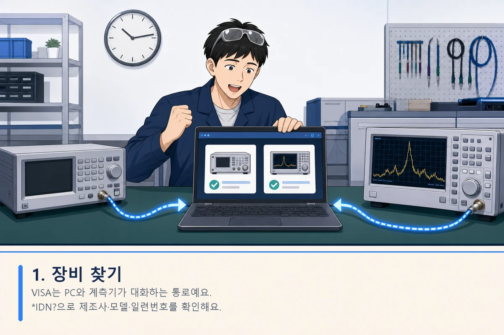

VISA는 PC와 계측기가 대화하는 통로다. 프로그램은 안전한 조회 명령인
`*IDN?`으로 제조사·모델·일련번호를 확인하고 장비 종류를 분류한다.

### 2. 사용할 기능 확인

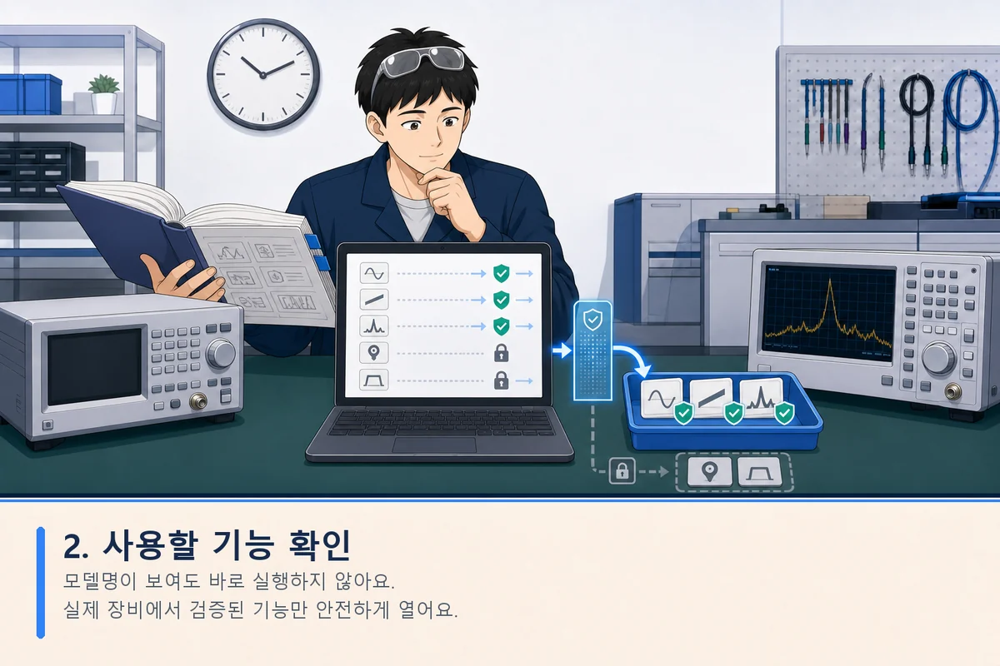

모델명이 보인다고 바로 명령을 실행하지 않는다. 후보 명령을 실제 장비에서
조회·설정·원복 순서로 확인하고 통과한 기능만 루틴에서 사용할 수 있게 연다.

### 3. 루틴 만들기

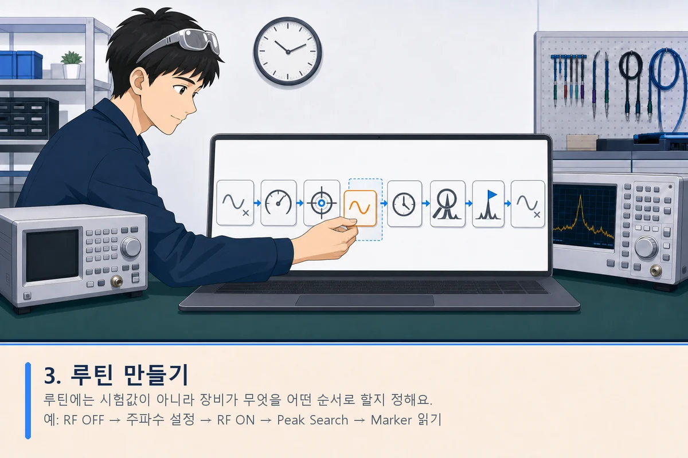

루틴에는 시험값이 아니라 장비가 무엇을 어떤 순서로 할지 정한다.
`RF OFF → 주파수 설정 → RF ON → 대기 → Peak Search → Marker 읽기`처럼
기능 블록을 순서대로 조립한다.

### 4. 시험 계획 작성

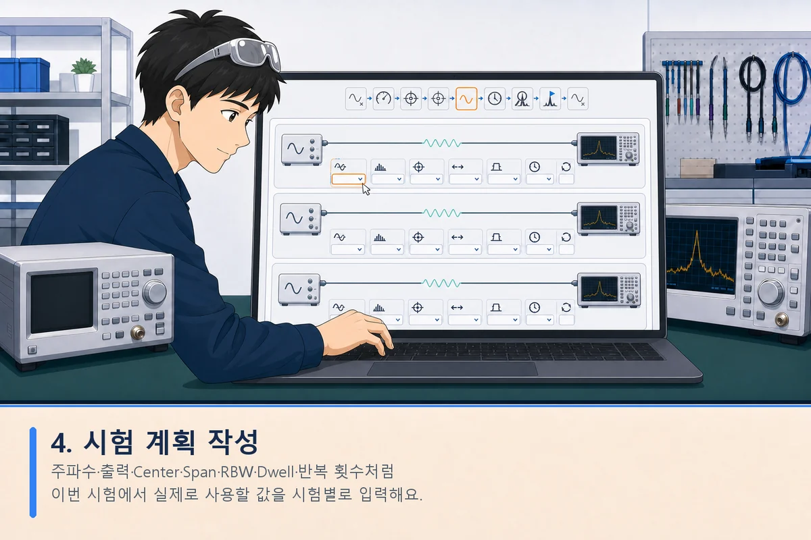

주파수·출력·Center·Span·RBW·VBW·Dwell·반복 횟수처럼 이번 시험에서
실제로 사용할 값을 입력한다. 같은 시험에 사용하는 신호발생기와 분석기
설정은 하나의 시험 케이스로 함께 묶인다.

### 5. 미리 점검하고 실행

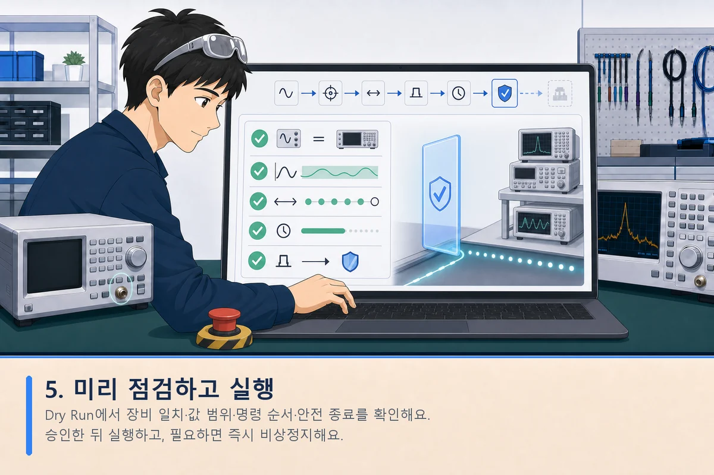

Dry Run은 장비에 명령을 보내기 전에 최종 명령, 장비 일치 여부, 값 범위,
실행 순서와 안전 종료 동작을 미리 확인하는 단계다. 운영자가 내용을 확인해
승인한 뒤 실제 실행하며, 통신 오류나 중지 요청이 발생하면 안전 종료를
시도한다.

### 6. 결과 저장

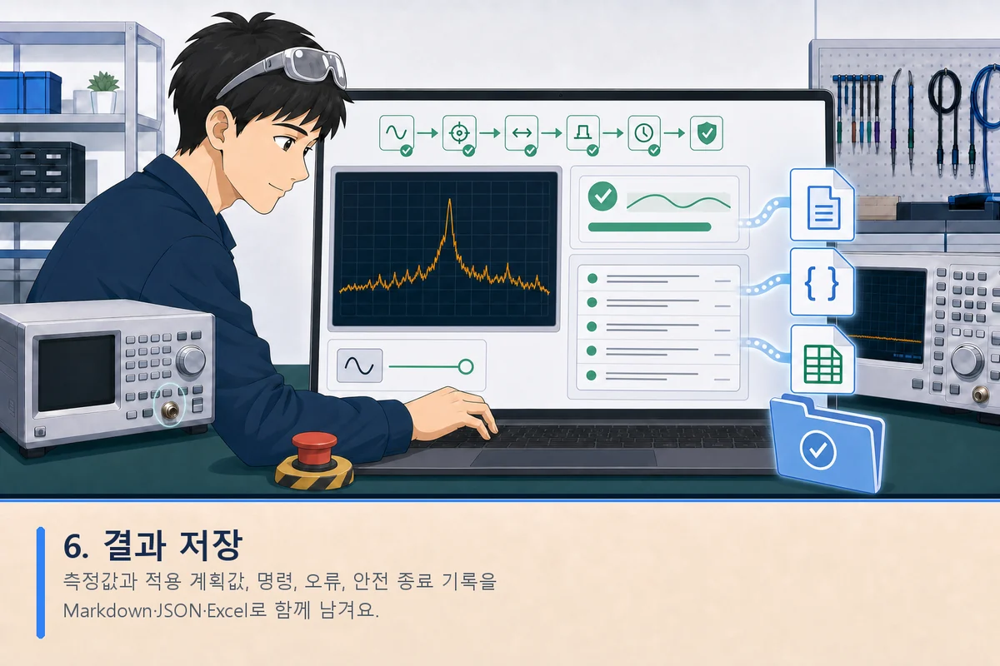

측정값뿐 아니라 적용한 계획값, 실제 명령, 장비 응답, 오류와 안전 종료
기록을 함께 남긴다. 결과는 Markdown·JSON·Excel 형식으로 저장할 수 있다.

> 위 그림은 사용 흐름을 설명하기 위한 AI 생성 일러스트다. 실제 계측기
> 화면과 외형은 제조사·모델에 따라 다르며, 그림 속 장비는 특정 제품을
> 나타내지 않는다.

## 현재 기능

- `장비 찾기 → 연결 확인 → 분류 확인 → 선택 완료` 4단계 안내
- VISA를 `PC와 장비가 대화하는 통로`, IDN을 `장비의 이름표`로 설명
- 기술 설정을 숨긴 현대적인 Tkinter + ttk 카드 화면
- 1280×780 기준으로 글자·버튼·여백이 창 크기에 맞춰 75~140% 범위에서 비례 조절
- 분류 결과를 `큰 장비 분류 카드 → 실제 장비 이름·설명` 순서로 묶어 표시
- 분류별 반응형 벡터 이미지와 세로 연결선으로 장비의 소속 관계를 한눈에 표현
- 실제 통신 없이 전체 결과 화면을 확인하는 데모 장비 4대
- VISA resource 검색
- GPIB/USB/TCPIP/PXI/VXI `INSTR` resource에 제한된 `*IDN?` 식별
- ASRL과 기타 interface 자동 open 제외
- 미발견·드라이버 오류별 `이렇게 해보세요` 해결 안내
- 고급 설정에서 VISA backend, timeout과 주소 직접 식별
- 고급 설정에서 수신한 IDN 문자열 직접 분류
- 로컬 카탈로그의 12개 OSS 근거 프로필을 `*IDN?` 패턴으로 매칭
- 정확히 매칭되지 않는 모델은 장비 종류와 기준으로 삼을 프로필을
  고르되, 다른 모델의 지원 기능을 그대로 상속하지 않음
- 명령팩의 operation마다 `통과 / 실패 / 미확인 / 건너뜀 / 위험 / 수동 확인`
  결과를 따로 기록
- 사용 권한이 있는 매뉴얼에서 사용자가 직접 만든 Query 후보는 저장소 밖의
  사용자 로컬 폴더에서만 불러오고 `응답 수신·미승격`으로 별도 기록함.
  응답형·파라미터·복구 규칙이 구조화되기 전에는 루틴 기능으로 승격하지 않음
- 사용자 로컬 후보를 `조회 / 설정 / 실행` 기능으로 구조화하는 편집창에서 실제
  SCPI template, 파라미터 타입·단위·최소·최대·선택값, 시험값, 응답형,
  위험도와 원복 Query를 명시
- 구조화한 후보는 IDN과 `*OPT?`를 다시 확인하고, Query 또는
  현재값 조회 → 시험값 쓰기 → Readback → 원복 → 원복 확인을 통과해야만
  `%LOCALAPPDATA%\SCPI-Automation-Platform\local_extensions.json`에 등록
- 옵션은 `조회됨 / 미지원 / 미조회`로 구분하고, 저장된 로컬 명령을 다시
  검증하기 전에도 live `*OPT?` 상태를 확인함
- 사용자 로컬 후보에서 만든 SET/EXECUTE는 사용자가 낮은 위험도로 지정할 수
  없고 항상 개별 고위험 승인을 요구함. `manual_only` 후보는 자동 Query로
  바꿀 수 없음
- 최초 승격한 로컬 기능은 검증 때 사용한 값·채널·Trace·선택지 조합만
  루틴에서 허용하며, 다른 인수 조합은 별도 후보로 다시 검증해야 함
- 로컬 기능 정의나 검증 증거가 변조됐거나 다른 제조사·모델·시리얼·펌웨어·
  옵션에서 만들어진 기록이면 루틴에서 차단
- 로컬 레지스트리는 HMAC-SHA256으로 인증하고 인증키는 Windows 현재 사용자
  DPAPI로 보호함. JSON·anti-rollback state·DPAPI key anchor의 세대와 digest가
  모두 일치해야 하며, 이전 JSON과 state만 함께 복원해도 fail-closed함.
  다른 Windows 사용자·PC로 복사한 로컬 기능은 다시 검증해야 함
- 완전한 로컬·오프라인 구조라 외부 단조 카운터는 없음. 같은 Windows 사용자가
  JSON·state·DPAPI key 세 파일을 모두 동일한 과거 스냅샷으로 되돌린 경우는
  탐지할 수 없으므로, 전체 백업 복원 뒤에는 로컬 기능을 다시 검증해야 함
- 여러 프로그램 창이 같은 레지스트리를 열어도 프로세스 잠금과
  generation/digest compare-and-swap을 사용함. 오래된 창은 저장을 거부하므로
  다른 창에서 철회한 기능을 예전 목록으로 되살릴 수 없음
- 실장비에서 통과한 operation만 최종 장비 기능으로 루틴에 노출
- 보수적인 모델군 추정과 미분류 구분
- 백그라운드 검색과 중지 요청
- 분류 결과 카드 오른쪽에서 사용할 장비를 여러 대 선택
- `선택한 장비 N대로 루틴 만들기` 버튼으로 명시적으로 루틴 설정 탭 이동
- 장비 Combobox와 사용 가능한 기능 Listbox
- 내 루틴 Listbox에 기능 추가, 위·아래 이동, 삭제와 전체 비우기
- 공통 단계에서 `Delay - 대기 시간`을 밀리초·초·분 중 편한 단위로 추가
- `Wait for Completion - 앞 작업 완료 확인`에 대상 장비와 초·분 제한 시간을 명시해 추가
- 루틴을 사람이 읽을 수 있는 UTF-8 `*.scpiroutine.json` 파일로 저장·불러오기
- `루틴 저장 및 다음 단계`에서 저장이 성공한 경우에만 계획서 탭으로 이동
- 루틴 파일 `schema_version=6`에 raw IDN, 장비 식별정보·펌웨어·옵션 상태와
  응답·카탈로그
  fingerprint, 배포 프로필, operation별 통과·실패·미확인 목록, 기능 ID,
  operation, 고정 입력값, 계획값 바인딩과 결과 변수명을 저장하고
  raw SCPI는 저장하지 않음
- 기존 `schema_version=1`~`schema_version=5` 루틴도 장비 요구사항은 읽을 수
  있지만, 저장된 상태·통과 allowlist는 어느 버전에서도 권한 근거로 신뢰하지
  않음. 현재 선택된 장비의 검증 결과와 다시 결합될 때만 명령 기능을 복원
- 장비 분류별 공통 기능 카드는 설명·데모용이며 실제 capability/operation
  ID가 없음. 최종 분류 또는 저장 루틴에서는 이 카드를 실행 명령으로 사용하지
  않고 operation별 PASS를 가진 모델 기능만 허용
- 12개 OSS 근거 프로필에 237개 capability와 390개 구조화된 SCPI operation을
  기능 그룹·검색·파라미터 입력창으로 제공하며, 실장비에서 `pass`가 된
  operation만 루틴의 실행 가능 기능으로 노출
- 주파수는 Hz/kHz/MHz/GHz, 시간·전압·전류·전력·저항은 자주 쓰는 SI 단위를
  고르게 하고, 기존 기준 단위로 환산한 값만 명령 검증과 저장에 전달
- `false/true`, `WRIT/MAXH` 같은 내부 선택값은 `끄기/켜기`,
  `Clear Write/Max Hold`처럼 뜻을 먼저 보여 주고 원래 값은 괄호로 표시
- 제조사 매뉴얼 원문·명령 헤더 목록·페이지 대응표는 내장하지 않으며,
  `manual_catalog.json`에는 문서명·버전·공식 링크 같은 서지정보만 보관
- FSV/FSVA 배포 프로필은 QCoDeS contrib의 permissive 소스로 확인한
  **14개 capability·25개 operation**만 포함
- Trace, Marker, Detector, Averaging 같은 공통 개념은 장비 분류 taxonomy와
  UI 설계에 남기되 FSV/FSVA 모델의 실제 SCPI 바인딩은 사용자가 보유한 장비에서
  독립적으로 검증한 뒤 로컬 기능으로 확장
- 사용자가 적법하게 보유한 매뉴얼의 로컬 추출물·OCR·명령 후보·페이지 매핑은
  저장소 밖 사용자 전용 폴더에만 두며 Git·설치본·실행파일에 포함하지 않음
- 불러올 때 현재 선택 장비의 resource와 식별정보를 다시 확인하고, 필요한 장비가 하나라도 없으면 기존 루틴을 유지한 채 누락 목록 안내
- 루틴 항목 우클릭으로 복제, 한 단계 이동, 맨 위·아래 이동과 삭제
- 세 번째 `계획서` 탭에서 선택한 스펙트럼 분석기와 신호발생기를 자동으로 표시
- `Center - 중심 주파수`, `Span - 주파수 분석 범위`, `RBW - 분해능 대역폭`, `VBW - 비디오 대역폭`, `Ref. Level - 화면 기준 레벨` 입력
- 신호발생기의 `Frequency - 출력 주파수`, `Power - 출력 설정값`, `Dwell - 주파수 유지 시간` 입력
- Hz/kHz/MHz/GHz 화면 단위를 내부 Hz 값으로 정규화하고 RBW·VBW 자동 모드를 별도 보관
- 분석기와 신호발생기 설정을 명시적인 `시험 01`, `시험 02` 케이스로 묶고,
  같은 케이스 안에는 장비 resource별 실행 설정을 하나만 저장
- 시험 케이스별 1~1000회 반복을 지정하고 오른쪽 목록에서 케이스 이름과
  각 장비 설정을 함께 확인
- 측정 조건을 오른쪽 계획 Listbox에 추가하고 위·아래 이동, 삭제와 전체 비우기
- `계획 상세 설정` 창에서 직접 입력한 주파수 목록 또는 시작·끝·간격을 최대 500개 계획으로 일괄 생성
- 스펙트럼 분석기는 여러 중심 주파수의 Peak/Marker 측정, 신호발생기는 여러 CW 주파수 단계 계획을 제공
- 8개 장비 분류에 25개 통상 시험 계획 템플릿과 장비별 상세 고려 항목 제공
- 계획서에서 표준·절차서, 시료, 환경, 교정, 반복, 합격 기준과 전기 안전을
  확인하고 Pulse·OVP/OCP·Bias·입력 정격 등 연관 조건도 함께 검증
- 분류별 상세 계획의 Hz·s·V·A·W·Ω 숫자도 표시 단위를 고를 수 있으며
  계획 데이터에는 기존 기준 단위로 정규화해 저장
- 배치의 모든 값을 먼저 검증한 뒤 한꺼번에 추가하며 입력 순서와 중복 주파수를 유지
- 신호발생기 RF ON/OFF는 계획에 숨겨 넣지 않고 루틴의 명시적 출력 단계로 유지
- 네 번째 `실제 실행` 탭에서 검증 루틴과 시험 계획을 좌우로 함께 표시
- 루틴의 수치 설정은 기본적으로 `시험 계획에서 가져오기`로 저장하고,
  채널·Trace·Marker·출력 ON/OFF 같은 절차 제어값은 루틴의 고정값으로 유지
- `(capability_id, operation, parameter)`별 검토된 allowlist만 계획 필드와
  연결하며 SCPI 문자열·한글 라벨·목록 순서로 값을 추측하지 않음
- 여러 장비의 평면 계획을 순번으로 자동 결합하지 않고, 같은 case ID로
  명시적으로 묶인 설정만 한 시험으로 실행
- 실행 전에 `시험 케이스 → 반복 → 루틴 순서`로 모든 단계를 완전히 펼치고,
  각 실제 값을 기존 operation PASS·모델 범위·로컬 exact-probe 검증에 다시
  통과시킨 뒤에만 VISA 세션을 엶
- RBW·VBW가 자동인데 수동 Set 단계가 계획값을 요구하거나, 케이스에 필요한
  장비값이 빠졌거나, 모델 범위를 넘으면 VISA 연결 전에 실행을 차단
- 고정 `Delay`와 별도로 신호발생기 계획의 `Dwell`만큼 기다리는 계획 연동
  대기 단계를 제공하며, `Wait for Completion` timeout은 안전 한계라 고정값 유지
- 현재 장비·루틴·계획 snapshot의 Dry Run이 성공해야 실제 실행 버튼이
  열리며, 내용이 바뀌면 다시 Dry Run이 필요
- 데모 장비는 Dry Run과 화면 연습만 허용하고 실제 SCPI 전송은 차단
- 실제 실행 확인창에는 대상 장비의 시리얼·resource와 보낼 설정을 요약하며,
  시험 케이스 수·확장 단계 수·발생기 주파수/출력 범위·분석기 중심주파수
  범위, 출력·배선·DUT 허용 범위 확인과 명시적 운영자 승인이 필요
- 실제 실행 직전 현재 프로필 fingerprint, raw `*IDN?`, 제조사·모델·
  시리얼·펌웨어·옵션을 다시 대조
- `Wait for Completion`은 해당 장비에서 PASS인 `*OPC?`가 있을 때만 실행
- 일반 중지와 긴급 안전정지 요청을 구분하고, 출력 장비 쓰기에는 검증된
  OFF operation이 있어야 하며 정상 완료·오류·중지·창 닫기 시 OFF 및
  가능한 readback을 기록
- `실제 값 디스플레이 보기` 창에서 선택한 여러 장비를 함께 또는 한 대씩
  확인. 별도 VISA 조회나 제조사 화면 복제 없이 루틴 Query가 실제로 반환한
  값만 표시하고, 조회 전에는 값이 없다고 명시
- Trace/Waveform으로 확인된 숫자 배열만 그래프로 그리며 임의 배열을
  파형으로 꾸미거나 없는 측정점을 보간하지 않음
- 다섯 번째 `결과 확인` 탭에서 측정값, 단계, 명령 로그와 오류를 확인
- 한 실행의 장비 정보, 루틴 template, 실제 확장 단계, 시험 case/repeat,
  적용된 계획 필드, 원본 응답, 해석값, 안전 종료 기록을
  Markdown, JSON, Excel로 개별 또는 일괄 저장
- Excel은 요약·장비·루틴·시험계획·측정결과·실행단계·명령로그·안전종료
  시트로 분리하고 SCPI 응답을 수식으로 해석하지 않도록 문자열로 기록
- 실제 실행이 끝나면 전체 원본 JSON을
  `%USERPROFILE%\Documents\SCPI 측정결과\자동저장`에 원자적으로 자동 저장하고,
  화면에서 Markdown·JSON·Excel을 원하는 위치에 추가 저장
- 긴 Trace 배열은 측정 레코드 한 곳에만 원본을 보관하고 단계·이벤트에는
  측정값 ID 참조를 남겨 결과 파일의 불필요한 중복을 줄임

실제 실행의 **완료·중지·오류 결과** JSON은 실행 worker가 종료된 직후 자동
저장한다. 다만 전원 차단이나 프로세스 강제 종료처럼 terminal result 자체를
만들지 못한 상황까지 복구하는 append-only JSONL 기록은 후속 안전 보강
범위다.

계획서의 표준 예시는 참고 후보이며 준수를 보증하지 않는다. 구조화된
스펙트럼 분석기·신호발생기 계획값은 명시적으로 바인딩한 수치 인수에만
사용한다. `frequency_plan` 같은 자유 텍스트, 시험 방법 설명, 합격 기준은
SCPI로 자동 변환하지 않는다. 장비별 명령, 옵션, 펌웨어와 모델 범위는
OSS 근거 프로필의 operation을 실장비에서 검증한 뒤에만 실행 엔진에 연결한다.

## 지원 판정 원칙

```text
장비 이름표(raw *IDN?, firmware, option 상태·응답)
  + 선택된 OSS 근거 프로필과 버전
  + operation별 실장비 검증 결과
  = 그 물리 장비의 최종 분류와 사용 가능 기능
```

장비 분류나 모델명 일치는 제어 권한을 부여하지 않는다. 검증은 다음 안전
단계를 구분한다.

1. **조회 단계** — 배포 프로필의 명시된 query와 부작용 없는 조회부터 실행하고,
   응답 형식·오류 큐·timeout을 확인한다.
2. **복원 가능한 설정 단계** — 현재값 조회 → 안전한 시험값 설정 → readback
   확인 → 원래 값 복원 → 복원 readback 순서로 확인한다.
3. **수동 승인 단계** — RF 출력, 전압·전류·전력, 파일·메모리 변경,
   calibration, reset처럼 상태나 에너지를 바꾸는 명령은 물리 조건과 한계를
   확인한 뒤 명시적으로 승인한다.
4. **사용자 로컬 후보 감사 단계** — 사용 권한이 있는 매뉴얼에서 사용자가
   저장소 밖에 만든 Query 후보만 한 개씩 승인해 응답 수신 여부를 기록한다.
   이 결과는 `pass`가 아니며 기능 allowlist에 들어가지 않는다.
5. **로컬 기능 승격 단계** — 사용자 로컬 후보를 typed operation으로 정리하고
   위와 같은 조회·가역 쓰기 검증을 다시 수행한다. Execute는 프로그램이 자동
   전송하지 않고 별도의 안전한 시험에서 관찰한 근거를 기록한다. 최초에는
   실제 시험한 인수 조합만 허용한다.
6. **최종 분류 단계** — 제조사·모델·시리얼·펌웨어, 옵션 응답, 프로필
   fingerprint와 operation별 근거가 일치할 때 통과 operation만 루틴에 연다.
   저장 파일의 allowlist만으로는 기능을 열지 않는다.

`fully_resolved`는 현재 배포 프로필의 operation 집합만 모두 판정됐다는 뜻이다.
제조사 매뉴얼 전체 명령을 포함하거나 검증했다는 뜻이 아니므로 UI는 이를
전 세계 명령 전체가 검증된 완전 지원 모델이라고 표시하지 않고 `부분 검증`으로
유지한다.

카탈로그의 `low / medium / high` 위험도와 검증 결과는 서로 다른 정보다.
위험도가 낮아도 아직 시험하지 않았으면 사용할 수 없고, 위험도가 높으면
명령 자체가 확인됐더라도 시험별 안전 한계와 추가 승인이 필요하다.

## 개발자로 실행하기

Python 3.10 이상이 있는 개발 PC:

```powershell
.\run_app.bat
```

또는:

```powershell
python .\run_app.py
```

Excel 저장 구성요소는 기본 설치에 포함된다. 실제 VISA 검색·실행에는
PyVISA와 사용할 VISA backend가 추가로 필요하다.

```powershell
python -m pip install -e ".[visa]"
```

PyVISA가 없어도 GUI와 `IDN 응답 직접 분류` 기능은 실행할 수 있다.

## 현재 화면

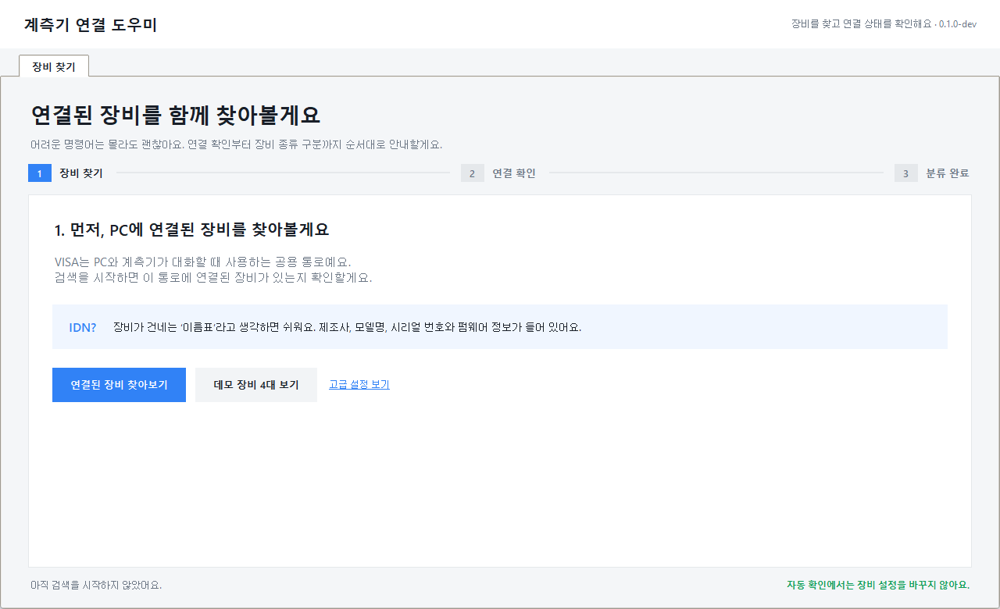

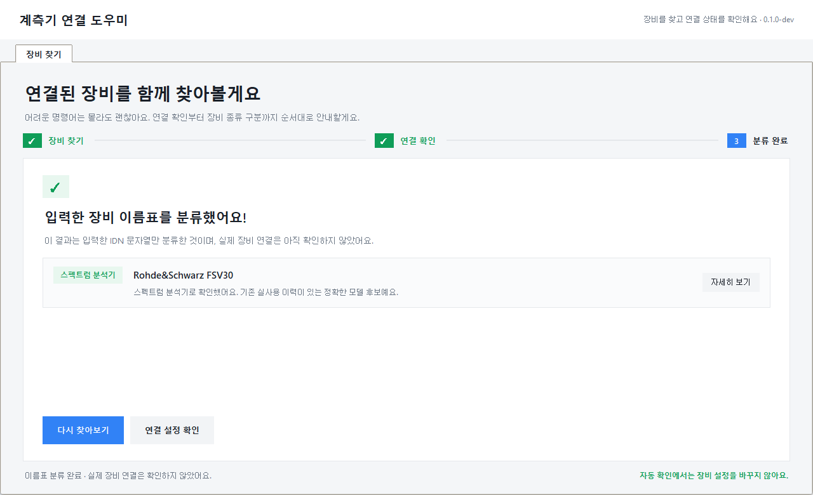

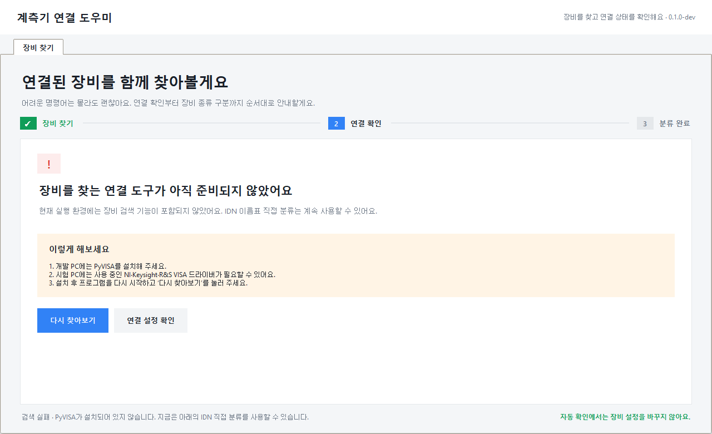

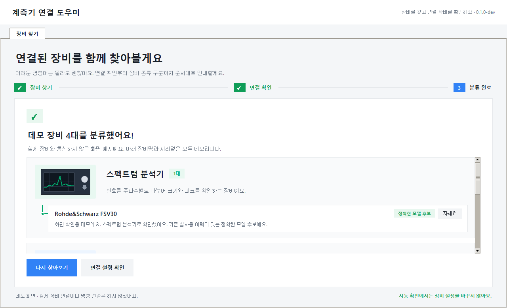

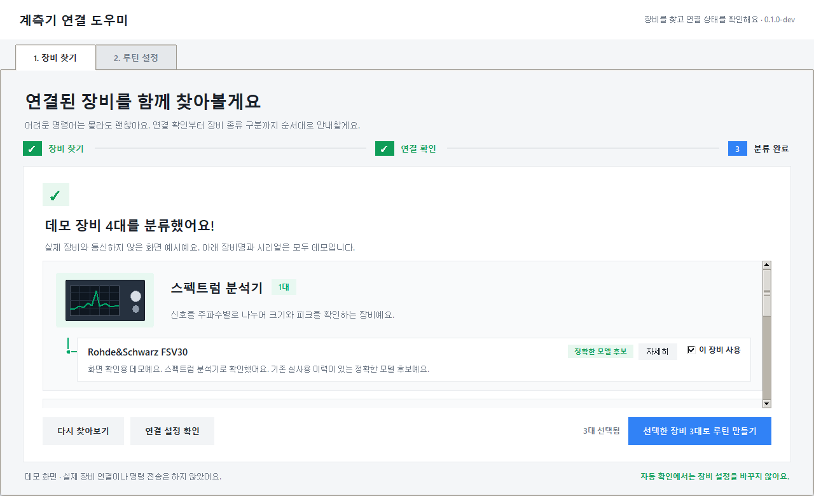

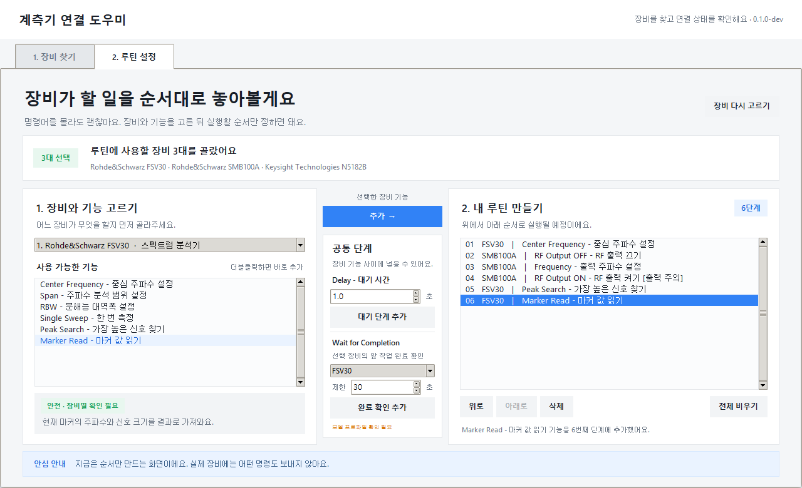

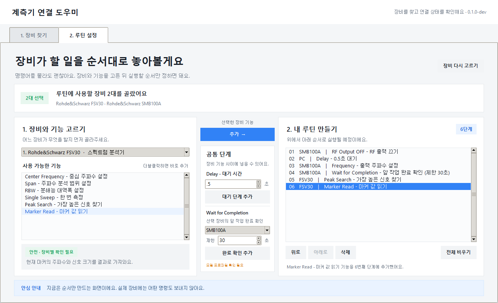

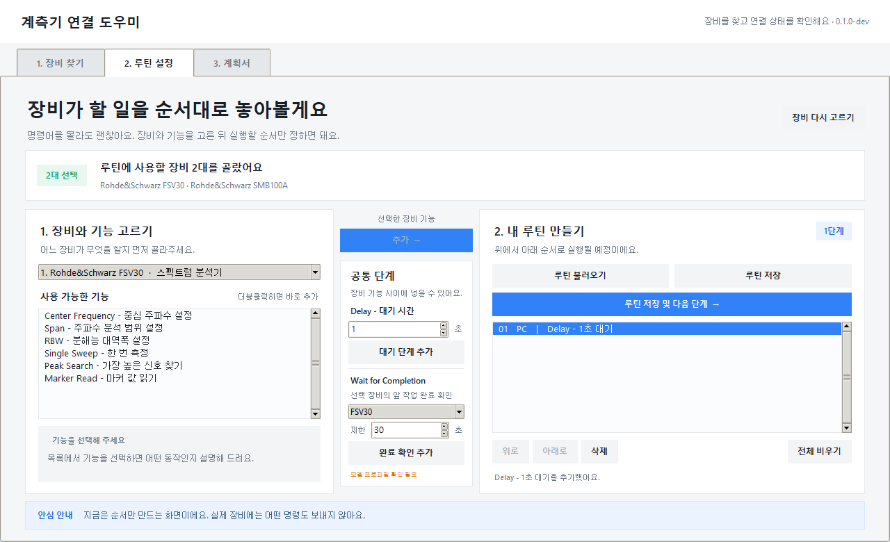

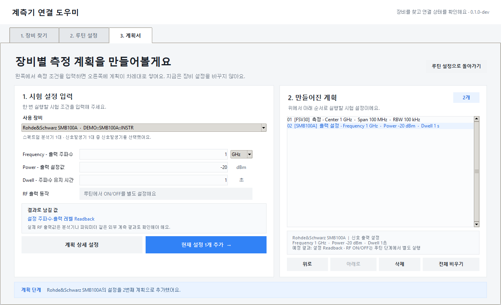

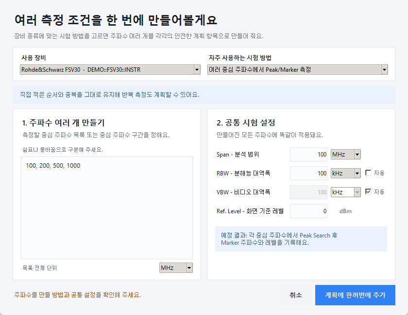

## 테스트

```powershell
$env:PYTHONPATH = "src"
python -m unittest discover -s tests -v
python .\run_app.py --smoke-test
```

## Windows 배포물 만들기

공식 Windows 빌드는 Python 3.11.9 x64 환경에서 고정된 wheel 해시를 확인한
뒤 생성한다. 출력 폴더는 기존 폴더를 덮어쓰지 않는다.

```powershell
py -3.11 -m venv .release-venv
.\.release-venv\Scripts\python.exe -m pip install --require-hashes `
  -r .\packaging\windows\requirements-build-win-py311.txt
.\.release-venv\Scripts\python.exe .\tools\build_windows_release.py `
  --output .\dist\SCPI-Automation-Platform-0.1.0.dev1-win64
```

빌드 도구는 EXE smoke test, PyInstaller TOC 검사, 제조사 VISA DLL·매뉴얼
산출물 차단, 정확한 런타임 라이선스 수집과 SHA-256 목록 생성을 모두
통과해야 배포 폴더를 만든다. `PyVISA-py` backend는 첫 공개 빌드에 포함하지
않는다.

`v0.1.0-dev.1`처럼 프로그램 버전과 일치하는 태그를 푸시하면
`release-windows.yml`이 동일한 검사를 다시 수행한 뒤 다음 공개 파일을
자동으로 만든다.

- 초보자용 사용자별 설치 프로그램
- 설치가 제한된 PC용 Portable ZIP
- 두 파일의 SHA-256 목록

설치 프로그램은 잠긴 Inno Setup 버전·SHA-256과 공식 게시자 서명을 확인한
뒤 빌드하며, 임시 사용자 폴더에 자동 설치 → 동결 EXE 자체 검사 → 제거까지
통과해야 Release에 올라간다.

## 문서

- [프로젝트 계획](PROJECT_PLAN.md)
- [GUI 설계](GUI_DESIGN.md)
- [장비 프로필 라이선스 감사](LICENSE_AUDIT.md)
- [제3자 라이선스 고지](THIRD_PARTY_NOTICES.md)
- [기여 안내](CONTRIBUTING.md)
- [보안 안내](SECURITY.md)

## 라이선스와 공개 배포

프로젝트 자체 코드는 [MIT License](LICENSE)로 공개한다. 이 저장소의
배포물은 무료로 제공하지만 MIT License는 제3자의 수정·재배포와 상업적
이용도 허용한다. 제3자 런타임과
모델 프로필 근거의 저작권·라이선스는
[THIRD_PARTY_NOTICES.md](THIRD_PARTY_NOTICES.md)에 별도로 유지한다.

Windows 실행파일은 실제 빌드에 포함된 Python·Tcl/Tk와 Python 패키지의
라이선스를 빌드 환경에서 수집한 뒤 `tools/prepare_windows_release.py`로
허용된 파일만 새 배포 폴더에 묶는다. 이 검사를 통과하지 않은 EXE는 공식
배포물로 간주하지 않는다. NI-VISA 또는 Keysight IO Libraries 같은 제조사
VISA DLL은 별도 재배포 허가 없이 실행파일에 포함하지 않는다.

이 프로젝트는 특정 제조사와 제휴하거나 보증받은 제품이 아니다. 제조사명과
모델명은 호환 장비 식별을 위한 지칭 목적으로만 사용한다. `SCPI`와 `VISA`
명칭도 통신 방식을 설명하기 위한 것이며 표준기관의 인증이나 공식 적합성
보증을 주장하지 않는다.
